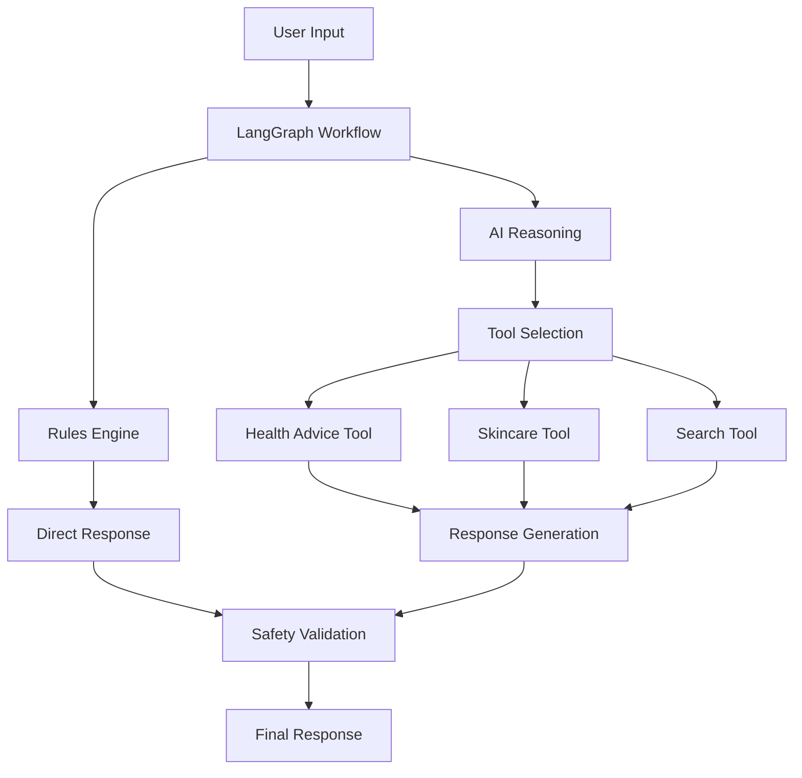

# Aara Health Agent Documentation

## 🌸 Welcome to Aara

**Aara** is an empathetic AI companion designed specifically for women's health and skincare. Built with cutting-edge technology including LangGraph workflows, advanced rule systems, and specialized tools, Aara provides personalized, evidence-based guidance while maintaining the highest safety standards.

## 🎯 What is Aara?

Aara is more than just a chatbot – she's your trusted health companion who:

- **Understands women's health** with specialized knowledge in menstrual health, PCOS, fertility, hormonal balance, and mental wellness
- **Provides skincare expertise** with personalized routines, ingredient analysis, and product recommendations
- **Prioritizes safety** with emergency detection, crisis intervention, and medical disclaimer systems
- **Offers empathetic support** through carefully crafted responses that acknowledge your concerns and emotions
- **Stays current** with real-time search capabilities for the latest health research and information

## 🏗️ Architecture Overview

## 🔧 Key Features

### 🏥 Women's Health Expertise
- **Menstrual Health**: Cycle tracking, irregularities, PMS/PMDD support
- **PCOS Management**: Comprehensive guidance for symptoms and lifestyle
- **Fertility Support**: Conception planning and reproductive health
- **Hormonal Health**: Thyroid, insulin resistance, menopause guidance
- **Mental Wellness**: Emotional support and stress management

### 🧴 Skincare Intelligence
- **Routine Building**: Personalized skincare routines for all skin types
- **Ingredient Analysis**: Science-based ingredient education and recommendations
- **Product Guidance**: Evidence-based product selection and usage
- **Skin Conditions**: Acne, aging, sensitivity, and hyperpigmentation support

### 🛡️ Safety First
- **Emergency Detection**: Automated identification of urgent situations
- **Crisis Intervention**: Immediate resources for mental health crises
- **Medical Disclaimers**: Clear boundaries between education and medical advice
- **Content Filtering**: Appropriate response filtering and validation

### 🔍 Real-Time Information
- **Current Research**: Latest studies and health findings
- **Product Updates**: New product launches and ingredient innovations
- **Health News**: Breaking developments in women's health

## 🚀 Getting Started

### Quick Start
1. **[Installation](getting-started/installation.md)** - Set up your environment
2. **[Configuration](getting-started/configuration.md)** - Configure API keys and settings
3. **[First Steps](getting-started/first-steps.md)** - Learn how to interact with Aara
4. **[Examples](examples/conversation-examples.md)** - See Aara in action

### For Developers
1. **[Project Structure](development/project-structure.md)** - Understand the codebase
2. **[Architecture](architecture/system-overview.md)** - Learn the system design
3. **[API Reference](api/workflow.md)** - Integrate with Aara's APIs
4. **[Contributing](appendices/contributing.md)** - Join the development

## 📊 System Statistics

- **500+ Rules**: Comprehensive rule-based responses
- **3000+ Data Points**: Extensive health and skincare knowledge
- **4 Specialized Tools**: Health advice, skincare, search, and safety
- **Multi-layer Safety**: Emergency detection and crisis intervention
- **Real-time Search**: Current information from trusted sources

## 🎨 What Makes Aara Special

### Empathetic Communication
Aara is designed to be more than informative – she's supportive, understanding, and acknowledges the emotional aspects of health concerns.

### Evidence-Based Guidance
Every recommendation is grounded in current medical research and dermatological science, with clear citations and disclaimers.

### Personalized Experience
Aara learns from your interactions to provide increasingly relevant and personalized advice while respecting your privacy.

### Safety-Focused Design
Multi-layered safety systems ensure appropriate responses and immediate help when needed.

## 🔄 Workflow Overview

Aara's sophisticated workflow handles every interaction through multiple stages:

1. **Input Processing**: User message analysis and intent recognition
2. **Rule Matching**: Fast pattern matching for common queries
3. **AI Reasoning**: Complex query analysis and tool selection
4. **Tool Execution**: Specialized processing for health, skincare, or search
5. **Response Generation**: Crafting empathetic, helpful responses
6. **Safety Validation**: Final safety checks and disclaimer addition
7. **Context Management**: Maintaining conversation continuity

## 🌟 Use Cases

### Health Consultations
- "I've been having irregular periods for 3 months. What should I know?"
- "Can you help me understand PCOS symptoms and management?"
- "I'm trying to conceive – what lifestyle changes should I consider?"

### Skincare Guidance
- "I have combination skin and don't know where to start with skincare"
- "What's the difference between retinol and retinoids?"
- "My skin is sensitive and reacts to most products. Help!"

### Research & Information
- "What's the latest research on hormonal acne treatments?"
- "Are there new treatments for PCOS?"
- "What do studies say about vitamin D and women's health?"

### Emergency Support
- Automatic detection of crisis situations
- Immediate resources for mental health emergencies
- Professional referral guidance

## 🛠️ Technical Foundation

### Core Technologies
- **LangGraph**: State-based workflow orchestration
- **OpenAI GPT-4**: Advanced language understanding and generation
- **ChromaDB**: Vector database for semantic search
- **Tavily**: Real-time web search integration
- **Python**: Robust backend implementation

### Architecture Principles
- **Safety First**: Multi-layer safety validation
- **Empathetic Design**: Human-centered interaction patterns
- **Evidence-Based**: Grounded in medical and scientific research
- **Scalable**: Designed for growth and expansion

## 📚 Documentation Structure

This documentation is organized into several key sections:

### 🚀 Getting Started
Complete setup and onboarding guides to get you up and running quickly.

### 🏗️ Architecture & Design
Deep dive into the system architecture, workflow design, and technical implementation.

### 🔧 Core Components
Detailed documentation of the rules system, tools, and safety mechanisms.

### 👩‍💻 Development Guide
Resources for developers looking to contribute or extend the system.

### 📖 API Reference
Complete API documentation for integration and customization.

### 🔍 Troubleshooting
Solutions for common issues and debugging guides.

### 💬 Examples & Use Cases
Real-world examples and conversation patterns.

### 📝 Appendices
Glossary, resources, and additional reference materials.

## 🤝 Community & Support

### Getting Help
- **GitHub Issues**: Report bugs and request features
- **Discussions**: Community Q&A and conversations
- **Documentation**: Comprehensive guides and references
- **Email Support**: Direct assistance for complex issues

### Contributing
We welcome contributions! Whether you're fixing bugs, adding features, improving documentation, or sharing feedback, your input helps make Aara better for everyone.

### Professional Support
Enterprise support and custom development services are available for organizations looking to integrate or extend Aara.

## 🎯 Mission

Our mission is to democratize access to quality women's health information and support. Aara represents a step toward more personalized, empathetic, and accessible healthcare guidance that respects women's unique needs and experiences.

## 🌈 Vision

We envision a future where every woman has access to personalized, evidence-based health guidance that empowers informed decision-making and promotes overall wellness.

---

**Ready to get started?** Begin with our [Quick Start Guide](getting-started/quick-start.md) or explore the [Architecture Overview](architecture/system-overview.md) to understand how Aara works.

**Have questions?** Check out our [FAQ](troubleshooting/common-issues.md) or join our [community discussions](https://github.com/your-org/aAara-health-agent/discussions).

**Welcome to the future of women's health support!** 🌸 