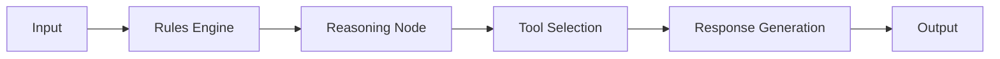
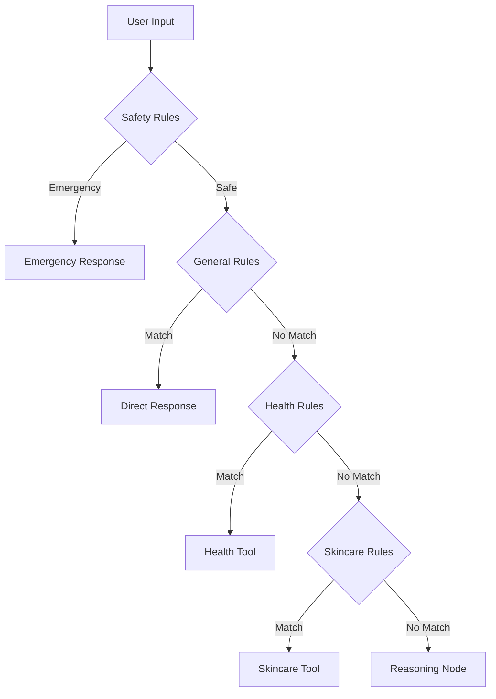
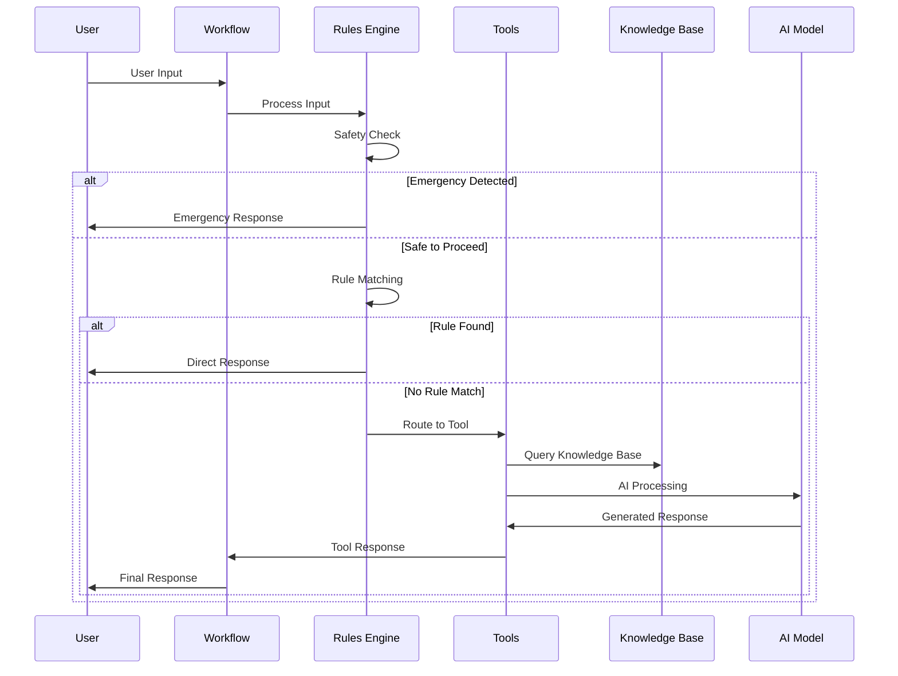
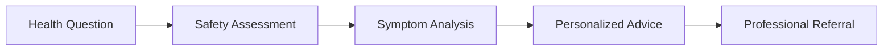
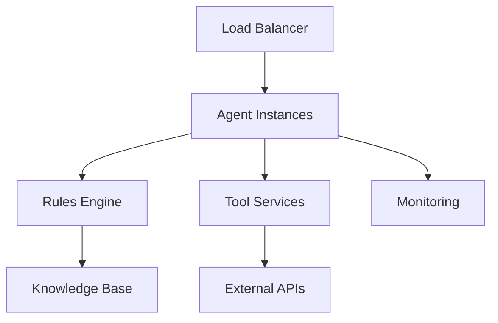

# System Overview

## 🏗️ High-Level Architecture

The Ara Health Agent is built on a modular, safety-first architecture that combines rule-based deterministic responses with AI-powered intelligent reasoning.

## 🎯 Design Principles

### 1. Safety First
- **Multi-layered safety checks** at every stage
- **Emergency detection** with immediate response protocols
- **Crisis intervention** resources always available
- **Medical disclaimers** for all health-related advice

### 2. Empathetic Communication
- **Women-centric design** addressing unique health needs
- **Non-judgmental responses** creating safe spaces
- **Culturally sensitive** and inclusive language
- **Emotional intelligence** in all interactions

### 3. Evidence-Based Guidance
- **Medical accuracy** through verified sources
- **Scientific backing** for all recommendations
- **Latest research** integration via real-time search
- **Professional standards** alignment

### 4. Personalization
- **Context-aware responses** based on user history
- **Individual needs assessment** for tailored advice
- **Adaptive learning** from user interactions
- **Customized recommendations** for unique situations

## 🔧 Core Components

### 1. LangGraph Workflow Engine


**Purpose**: Orchestrates the entire conversation flow
**Technology**: LangGraph StateGraph
**Features**:
- State management across conversation turns
- Conditional routing based on user needs
- Tool integration and coordination
- Memory and context preservation

### 2. Rules Engine


**Purpose**: Provides fast, deterministic responses for known patterns
**Priority Order**:
1. **Safety Rules** (Highest priority)
2. **General Rules** (Greetings, agent info, platform info)
3. **Health Rules** (Medical topics and routing)
4. **Skincare Rules** (Skincare topics and routing)

### 3. Specialized Tools

#### Health Advice Tool
- **PCOS management** and symptom tracking
- **Menstrual health** guidance and cycle support
- **Fertility advice** and conception planning
- **Hormonal health** assessment and tips

#### Skincare Tool
- **Skin type analysis** and routine building
- **Product recommendations** based on skin needs
- **Ingredient education** and compatibility checks
- **Condition-specific advice** for acne, aging, sensitivity

#### Search Tool
- **Real-time information** retrieval via Tavily API
- **Latest research** and medical updates
- **Product reviews** and ingredient studies
- **Health news** and trend analysis

### 4. Knowledge Base
- **Comprehensive health data** (35KB+ of curated information)
- **Skincare science** and product databases
- **Emergency protocols** and crisis resources
- **Cultural health practices** and diverse perspectives

## 📊 Data Flow Architecture



## 🛡️ Safety Architecture

### Multi-Layer Safety System

1. **Input Validation**
   - Harmful content detection
   - Intent classification
   - Risk assessment

2. **Emergency Detection**
   - Crisis keyword matching
   - Severity assessment
   - Immediate response protocols

3. **Response Filtering**
   - Medical disclaimer addition
   - Harmful advice prevention
   - Professional referral triggers

4. **Output Validation**
   - Safety compliance checks
   - Accuracy verification
   - Empathy assessment

## 🔄 State Management

The system maintains conversation state through:

### Conversation Memory
```python
{
    "user_input": "Current user message",
    "chat_history": ["Previous messages"],
    "intermediate_steps": ["Processing steps"],
    "context": {"User preferences", "Health profile"},
    "final_response": "Generated response"
}
```

### Persistent Context
- **User preferences** and health profile
- **Previous consultations** and recommendations
- **Ongoing health tracking** (cycles, symptoms)
- **Personalization data** for improved responses

## 🎨 User Experience Flow

### 1. Initial Interaction


### 2. Health Consultation


### 3. Skincare Guidance


## 🔌 Integration Points

### External APIs
- **OpenAI GPT-4**: Primary language model
- **Tavily Search**: Real-time information retrieval
- **ChromaDB**: Vector database for knowledge storage

### Internal Components
- **Configuration Management**: YAML-based settings
- **Logging System**: Comprehensive activity tracking
- **Testing Framework**: Automated quality assurance
- **Deployment Pipeline**: Docker containerization

## 📈 Scalability Considerations

### Performance Optimization
- **Rule-based shortcuts** for common queries
- **Caching mechanisms** for frequent responses
- **Asynchronous processing** for tool operations
- **Load balancing** for high-traffic scenarios

### Extensibility
- **Modular tool architecture** for easy additions
- **Plugin system** for specialized features
- **API-first design** for third-party integrations
- **Configuration-driven** behavior modification

## 🔒 Security & Privacy

### Data Protection
- **No personal health data storage** beyond session
- **Encrypted communications** for all interactions
- **HIPAA-compliant** data handling practices
- **User consent** for any data processing

### Access Control
- **API key management** for service access
- **Rate limiting** to prevent abuse
- **Audit logging** for security monitoring
- **Secure configuration** management

## 🚀 Deployment Architecture

### Local Development
```
aara-health-agent/
├── src/agent/          # Core agent logic
├── tools/              # Specialized tools
├── rules/              # Rule definitions
├── data/               # Knowledge base
├── config/             # Configuration files
└── scripts/            # Utility scripts
```

### Production Deployment


This architecture ensures Ara provides safe, accurate, and empathetic health guidance while maintaining high performance and reliability. 