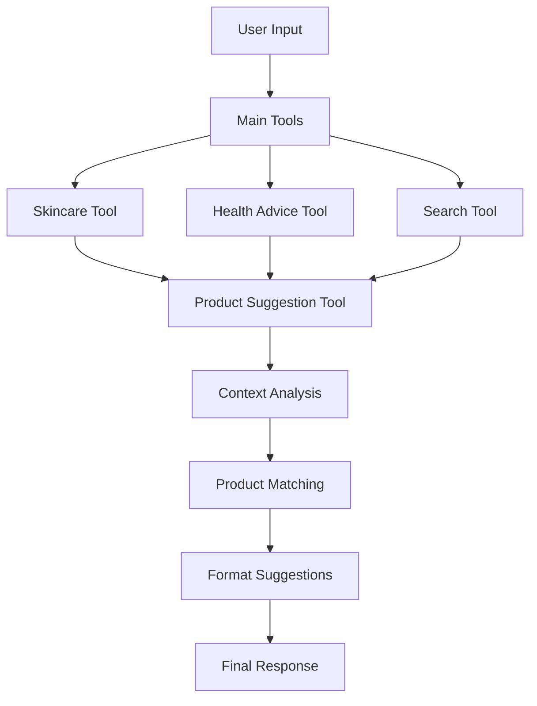

# Product Suggestion Feature

## 🛒 Overview

The Product Suggestion feature intelligently analyzes conversations to recommend relevant health and skincare products with affiliate links. It's designed to be helpful, non-intrusive, and contextually appropriate.

## 🎯 Key Features

### Smart Context Analysis
- **Conversation Understanding**: Analyzes current message and chat history
- **Intent Recognition**: Identifies skin types, health concerns, and product needs
- **Relevance Scoring**: Ranks products based on user context
- **Safety Filters**: Prevents suggestions during emergencies or when explicitly declined

### Seamless Integration
- **Automatic Triggering**: Runs after main tools (skincare, health advice, search)
- **Natural Presentation**: Appends suggestions to existing responses
- **Proper Disclaimers**: Includes transparency about affiliate relationships
- **Configurable Settings**: Easy to customize products and settings

## 🔄 How It Works

### 1. Workflow Integration



### 2. Context Analysis Process

The system analyzes:
- **Current Message**: Keywords, skin types, concerns
- **Chat History**: Previous mentions of products or issues
- **User Preferences**: Budget indicators, brand preferences
- **Safety Filters**: Emergency keywords, explicit opt-outs

### 3. Product Matching Algorithm

```python
def relevance_scoring():
    score = 0
    if skin_type_match: score += 3
    if concern_match: score += 2  
    if product_mention_match: score += 1
    return score
```

## ⚙️ Configuration

### Setting Up Affiliate Links

1. **Edit Configuration File**: `config/affiliate_links.yaml`
2. **Update Links**: Replace placeholder URLs with your affiliate links
3. **Add Products**: Extend the product database as needed

```yaml
affiliate_settings:
  enable_product_suggestions: true
  max_suggestions_per_response: 2
  disclaimer_text: "Your custom disclaimer here..."

products:
  skincare:
    cleansers:
      - name: "Your Product Name"
        affiliate_link: "https://your-affiliate-link.com"
        # ... other fields
```

### Affiliate Program Integration

Popular programs for health/skincare:

| Platform | Commission Rate | Notes |
|----------|----------------|-------|
| Amazon Associates | 1-10% | Wide product selection |
| Sephora | 2-8% | Premium beauty brands |
| iHerb | 5-10% | Health supplements |
| Dermstore | 2-6% | Professional skincare |

## 🎨 User Experience

### Example Conversation Flow

**User**: "I have oily skin with acne. What routine should I use?"

**Aara**: "For oily, acne-prone skin, I recommend: morning cleanser with salicylic acid, oil-free moisturizer, and non-comedogenic sunscreen..."

**💡 Product Suggestions Based on Our Conversation:**

**1. CeraVe Foaming Facial Cleanser** ($12-15)
*Gentle foaming cleanser with ceramides and hyaluronic acid*
**Why I recommend this:** Contains ceramides to restore skin barrier while effectively removing oil
[Shop Here 🛒](https://amzn.to/your-link)

**2. The Ordinary Niacinamide 10% + Zinc 1%** ($7-10)
*Serum to reduce appeAarance of blemishes and congestion*
**Why I recommend this:** Clinical concentration of niacinamide helps control oil production
[Shop Here 🛒](https://beautylish.com/your-link)

*Please note: These are affiliate links...*

### When Suggestions DON'T Appear

- **Emergency Situations**: "severe pain", "heavy bleeding"
- **User Opt-out**: "no products", "no recommendations"
- **Irrelevant Context**: General greetings, non-health topics
- **Safety Topics**: Crisis intervention, mental health emergencies

## 🔧 Technical Implementation

### Key Components

#### 1. Product Class
```python
@dataclass
class Product:
    name: str
    description: str
    category: str
    subcategory: str
    price_range: str
    affiliate_link: str
    keywords: List[str]
    recommended_for: List[str]
    why_recommended: str
```

#### 2. Context Analysis
```python
def analyze_conversation_context(user_input, chat_history):
    # Extracts skin types, concerns, product mentions
    # Returns structured context dictionary
```

#### 3. Product Matching
```python
def get_relevant_products(context, max_suggestions=2):
    # Scores products based on relevance
    # Returns top-ranked suggestions
```

### Integration Points

#### Workflow Node
```python
workflow.add_node("product_suggestion", product_suggestion_tool)
workflow.add_edge("skincare_tool", "product_suggestion")
```

#### Tool Function
```python
def product_suggestion_tool(state: Dict[str, Any]) -> Dict[str, Any]:
    # Main entry point for the feature
    # Handles safety checks and context analysis
```

## 📊 Analytics & Optimization

### Tracking Suggestions

The system logs:
- **Context Extracted**: User concerns and preferences
- **Products Suggested**: Which products were recommended
- **Suggestion Reason**: Why products were chosen
- **User Response**: Engagement with suggestions

### A/B Testing Opportunities

1. **Suggestion Timing**: Before vs. after main response
2. **Number of Products**: 1 vs. 2 vs. 3 suggestions
3. **Presentation Format**: List vs. cards vs. inline
4. **Disclaimer Placement**: Top vs. bottom of suggestions

## 🛡️ Safety & Ethics

### Ethical Guidelines

1. **Transparency**: Clear affiliate relationship disclosure
2. **Relevance**: Only suggest genuinely helpful products
3. **Safety First**: Never suggest products during emergencies
4. **User Control**: Respect opt-out preferences
5. **Quality Focus**: Recommend evidence-based products

### Safety Filters

```python
emergency_keywords = [
    'emergency', 'crisis', 'severe pain', 
    'heavy bleeding', 'suicide', 'self harm'
]

opt_out_phrases = [
    'no products', 'no recommendations', 
    'no shopping', 'don\'t suggest'
]
```

## 📈 Performance Considerations

### Optimization Strategies

1. **Caching**: Cache product database in memory
2. **Lazy Loading**: Load products only when needed
3. **Relevance Thresholds**: Skip suggestions below minimum score
4. **Rate Limiting**: Limit suggestions per conversation

### Resource Usage

- **Memory**: ~100KB for product database
- **Processing**: <50ms for context analysis
- **Network**: Minimal (loads from local YAML)

## 🔄 Maintenance

### Regular Updates

1. **Link Validation**: Check affiliate links monthly
2. **Product Refresh**: Update product database quarterly
3. **Performance Review**: Analyze suggestion relevance
4. **User Feedback**: Incorporate user preferences

### Troubleshooting

#### Common Issues

**No suggestions appearing:**
- Check `enable_product_suggestions: true` in config
- Verify YAML file syntax
- Ensure workflow integration is correct

**Wrong products suggested:**
- Review keyword mappings
- Check `recommended_for` arrays
- Adjust relevance scoring algorithm

**Affiliate links not working:**
- Verify link format and validity
- Check affiliate program status
- Test links in incognito mode

## 🚀 Future Enhancements

### Planned Features

1. **Dynamic Pricing**: Real-time price updates via APIs
2. **User Preferences**: Remember individual preferences
3. **Seasonal Adjustments**: Adapt suggestions by season
4. **Multi-language Support**: Localized product suggestions
5. **Advanced Analytics**: Conversion tracking and optimization

### Integration Ideas

1. **CRM Integration**: Sync with customer databases
2. **Inventory APIs**: Real-time stock checking
3. **Review APIs**: Include product ratings
4. **Price Comparison**: Show multiple retailer options

## 📝 Testing

### Running Tests

```bash
# Test the feature
python test_product_suggestions.py

# Test in conversation
python scripts/run_agent.py
```

### Test Scenarios

1. **Skincare Questions**: "oily skin acne routine"
2. **Health Concerns**: "PCOS irregular periods"
3. **Product Requests**: "need gentle cleanser"
4. **Emergency Situations**: "severe bleeding emergency"
5. **Opt-out Requests**: "no product recommendations"

## 💰 Revenue Optimization

### Best Practices

1. **Quality Over Quantity**: Fewer, more relevant suggestions
2. **Trust Building**: Focus on genuinely helpful products
3. **Timing**: Suggest after providing value
4. **Variety**: Include different price points
5. **Seasonality**: Adapt to seasonal needs

### Conversion Strategies

1. **Educational Content**: Explain why products are recommended
2. **Social Proof**: Include reviews or ratings when available
3. **Urgency**: Limited-time offers or seasonal relevance
4. **Bundle Suggestions**: Complementary products together

---

## Quick Setup Checklist

- [ ] Update affiliate links in `config/affiliate_links.yaml`
- [ ] Test with `python test_product_suggestions.py`
- [ ] Verify workflow integration
- [ ] Set appropriate disclaimer text
- [ ] Configure max suggestions per response
- [ ] Test various conversation scenarios
- [ ] Monitor suggestion relevance and user feedback

The product suggestion feature is designed to enhance user experience while providing a monetization opportunity through carefully curated, relevant product recommendations. 